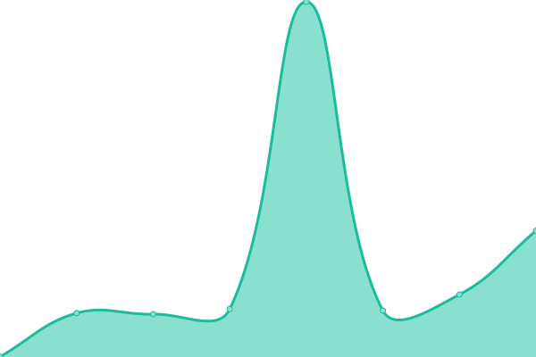

# [📈 Live Status](https://www.prosecit.de): <!--live status--> **🟩 All systems operational**

This repository contains the open-source uptime monitor and status page for [fmoerdel](https://www.prosecit.de), powered by [Upptime](https://github.com/upptime/upptime).

With [Upptime](https://upptime.js.org), you can get your own unlimited and free uptime monitor and status page, powered entirely by a GitHub repository. We use [Issues](https://github.com/fmoerdel/secit-uptime/issues) as incident reports, [Actions](https://github.com/fmoerdel/secit-uptime/actions) as uptime monitors, and [Pages](https://www.prosecit.de) for the status page.

<!--start: status pages-->
<!-- This summary is generated by Upptime (https://github.com/upptime/upptime) -->
<!-- Do not edit this manually, your changes will be overwritten -->
<!-- prettier-ignore -->
| URL | Status | History | Response Time | Uptime |
| --- | ------ | ------- | ------------- | ------ |
|  [Google](https://www.google.com) | 🟩 Up | [google.yml](https://github.com/fmoerdel/secit-uptime/commits/HEAD/history/google.yml) | 

 71ms
     
 | 

<a href="https://fmoerdel.github.io/secit-uptime/history/google">100.00%</a>
    

|  [Info](https://linuxhandbook.com/) | 🟩 Up | [info.yml](https://github.com/fmoerdel/secit-uptime/commits/HEAD/history/info.yml) | 

 1019ms
     
 | 

<a href="https://fmoerdel.github.io/secit-uptime/history/info">100.00%</a>
    

|  [Hacker News](https://news.ycombinator.com) | 🟩 Up | [hacker-news.yml](https://github.com/fmoerdel/secit-uptime/commits/HEAD/history/hacker-news.yml) | 

 421ms
     
 | 

<a href="https://fmoerdel.github.io/secit-uptime/history/hacker-news">100.00%</a>
    

|  [Broken Site](https://itsfoss.com/) | 🟩 Up | [broken-site.yml](https://github.com/fmoerdel/secit-uptime/commits/HEAD/history/broken-site.yml) | 

 125ms
     
 | 

<a href="https://fmoerdel.github.io/secit-uptime/history/broken-site">100.00%</a>
    

|  [Test for HEAD](https://www.google.com) | 🟩 Up | [test-for-head.yml](https://github.com/fmoerdel/secit-uptime/commits/HEAD/history/test-for-head.yml) | 

 13ms
     
 | 

<a href="https://fmoerdel.github.io/secit-uptime/history/test-for-head">100.00%</a>
    

|  Secret Site | 🟩 Up | [secret-site.yml](https://github.com/fmoerdel/secit-uptime/commits/HEAD/history/secret-site.yml) | 

 680ms
     
 | 

<a href="https://fmoerdel.github.io/secit-uptime/history/secret-site">100.00%</a>
    

|  [Test](https://news.itsfoss.com/) | 🟩 Up | [test.yml](https://github.com/fmoerdel/secit-uptime/commits/HEAD/history/test.yml) | 

 869ms
     
 | 

<a href="https://fmoerdel.github.io/secit-uptime/history/test">99.52%</a>
    

<!--end: status pages-->

[**Visit our status website →**](https://www.prosecit.de)

## 📄 License

- Powered by: [Upptime](https://github.com/upptime/upptime)
- Code: [MIT](./LICENSE) © [fmoerdel](https://www.prosecit.de)
- Data in the `./history` directory: [Open Database License](https://opendatacommons.org/licenses/odbl/1-0/)
